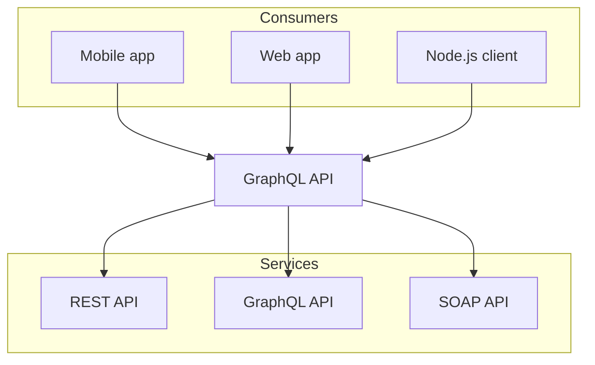

## Lorem

Lorem ipsum dolor sit amet, consectetur adipiscing elit. Sed do eiusmod tempor incididunt ut labore et dolore magna aliqua. Ut enim ad minim veniam, quis nostrud exercitation ullamco laboris nisi ut aliquip ex ea commodo consequat. Duis aute irure dolor in reprehenderit in voluptate velit esse cillum dolore eu fugiat nulla pariatur.

Excepteur sint occaecat cupidatat non proident, sunt in culpa qui officia deserunt mollit anim id est laborum. Sed ut perspiciatis unde omnis iste natus error sit voluptatem accusantium doloremque laudantium, totam rem aperiam, eaque ipsa quae ab illo inventore veritatis et quasi architecto beatae vitae dicta sunt explicabo.

### Inline Elements

This paragraph has **bold text**, *italic text*, ***bold italic***, `inline code`, and ~~strikethrough~~. You can also use ==highlighted text== from Obsidian syntax. Here is a [regular link](https://example.com) and an internal wikilink to [[lorem]].

> Blockquote lorem ipsum dolor sit amet, consectetur adipiscing elit. Sed do eiusmod tempor incididunt ut labore.

### Headings (H3)

#### H3 Heading

##### H4 Heading

###### H5 Heading

###### H6 Heading

### Lists

#### Unordered List

- First item lorem ipsum
- Second item with nested children
  - Nested child A
  - Nested child B
    - Deeply nested item
- Third item

#### Ordered List

1. First step lorem ipsum
2. Second step dolor sit
3. Third step consectetur
   1. Nested ordered A
   2. Nested ordered B
4. Fourth step adipiscing

#### Task List

- [x] Completed task lorem
- [x] Another done item
- [ ] Pending task ipsum
- [ ] Another pending item

### Callout

> [!info]
> This is an **info** callout. Lorem ipsum dolor sit amet, consectetur adipiscing elit.

> [!warning]
> This is a **warning** callout. Sed do eiusmod tempor incididunt ut labore et dolore.

> [!danger]
> This is a **danger** callout. Ut enim ad minim veniam, quis nostrud exercitation.

> [!note]
> This is a **note** callout. Duis aute irure dolor in reprehenderit in voluptate.

### Code

#### Inline Code

Use `const x = 42` to define a variable. Use `npm install` to install packages.

#### Code Block

```python title="lorem_ipsum.py"
def lorem_ipsum(n: int) -> str:
    """Generate lorem ipsum text."""
    words = ["lorem", "ipsum", "dolor", "sit", "amet"]
    result = []
    for i in range(n):
        result.append(words[i % len(words)])  # [!code highlight]
    return " ".join(result)


if __name__ == "__main__":
    print(lorem_ipsum(10))
```

```bash title="script.sh"
#!/bin/bash
# Lorem ipsum script
echo "Hello, Lorem!" # [!code ++]
for i in {1..5}; do
    echo "Iteration $i: lorem ipsum dolor"
done
```

```typescript title="config.ts" lineNumbers
interface LoremConfig {
  count: number;
  prefix?: string;
}

function generateLorem({ count, prefix = "" }: LoremConfig): string[] {
  return Array.from({ length: count }, (_, i) => `${prefix} lorem-${i}`);
}
```

### Table

| Component   | Type     | Description                        | Status |
| ----------- | -------- | ---------------------------------- | ------ |
| Callout     | Block    | Highlighted notice box             | Active |
| CodeBlock   | Block    | Syntax-highlighted code            | Active |
| Table       | Block    | Tabular data display               | Active |
| Heading     | Inline   | Section title with anchor          | Active |
| Wikilink    | Inline   | Internal cross-reference           | Active |
| Task List   | Block    | Checkbox-style list items          | Active |

### Horizontal Rule

---

### Math (if supported)

Lorem ipsum dolor $\sum_{i=1}^{n} i = \frac{n(n+1)}{2}$ sit amet.

Block math:

$$
\int_0^\infty e^{-x^2} dx = \frac{\sqrt{\pi}}{2}
$$

### Mermaid Diagram



### Footnotes

Lorem ipsum dolor sit amet[^1], consectetur adipiscing elit[^2].

[^1]: First footnote: lorem ipsum detail.
[^2]: Second footnote: consectetur adipiscing detail.

### Definition List

Lorem
: A placeholder text used in typesetting and design.

Ipsum
: The second word of the classic lorem ipsum sequence.

### Image Placeholder


### Nested Blockquote

> Outer quote lorem ipsum dolor sit amet.
>
> > Inner nested quote consectetur adipiscing elit. Sed do eiusmod tempor.

### Mixed Content

1. First, read the [[internal]] glossary.
2. Then check the [[lorem]] documentation.
   - Review the `README` file
   - Run `pnpm build` to verify
3. Finally, consult the [external docs](https://fumadocs.com).

> [!tip]
> Mix and match components — callouts, code blocks, tables, and wikilinks all work together seamlessly.

---

End of lorem ipsum component showcase.
